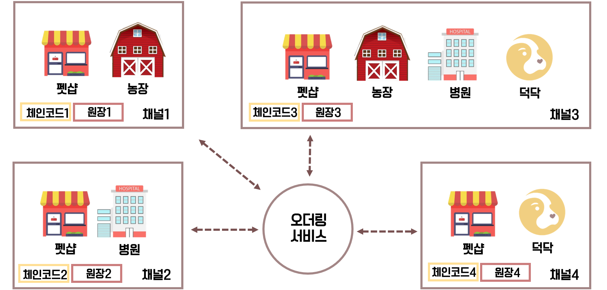

## 독돜 블록체인 네트워크

[](https://www.docker.com/)
[](https://www.hyperledger.org/projects/fabric)

{:height="50%" width="50%"}

 
 
 Description
 -----------
 반려동물 분양과정 투명화를 위한 프라이빗 블록체인 네트워크
 
 ### Dog + Documents 
 
 Network Structure
 -----------------


 Shared Documents
 ----------------


 Network Up
 -------------
```bash
 ./dogdoq.sh up
```
 Network Down
 -------------
```bash
 ./down.sh
```

